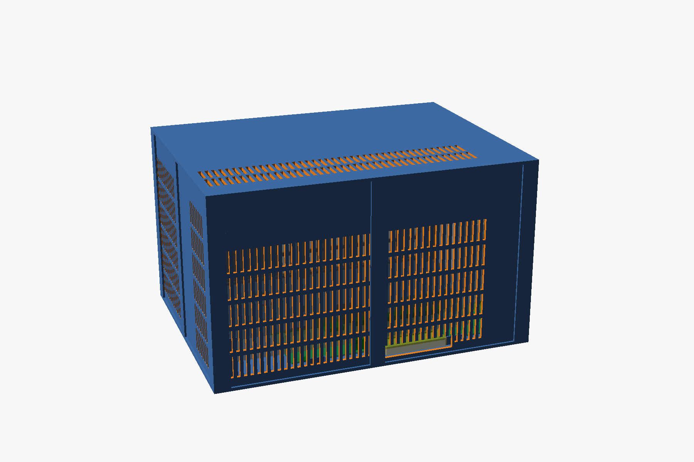

# A print-only case for the Lite board

`xgm-lite-frame.scad` is a parametric OpenSCAD enclosure for an **XG Mobile Station Lite** board
(osy's open-source XG Mobile dock, "Lite" variant), a **desktop graphics card** and an **ATX power
supply**. It needs no screws, threaded inserts, glue, magnets or 90° power adapters: the board sits on
printed pegs, the panels slide into printed posts, the lid pegs into the posts, the PSU is held by its
own weight and a few stops, and the card is held by the PCIe slot plus a printed cradle under its far end.

The defaults are the parts it was drawn around:

| Part | Default | Parameter(s) |
|---|---|---|
| Board | XG Mobile Station Lite, 220 × 65 mm, five Ø3.2 holes, geometry read from osy's KiCad file | `board_*`, `holes`, `pcie_*` |
| GPU | Inno3D RTX 3060 Twin X2 OC: 240 × 120 mm, 2-slot (42 mm), one 8-pin on top | `gpu_len`, `gpu_h`, `gpu_w` |
| PSU | ATX, 160 × 150 × 86 mm (Corsair RM850x and friends) | `psu_l`, `psu_w`, `psu_h` |

Outside dimensions with the defaults: **300 × 228 × 177 mm**. The PSU lies on its side along one
long wall with its fan against a grille, the board and the card take the other half, the GPU's fans
face the opposite side wall, and the 130 mm behind the PSU is the cable bay for the modular cables.

## Airflow

- GPU intake: the whole +Y wall in front of the card's fans is slotted.
- GPU exhaust: slots in the lid above the card and in the far end wall; the card's own bracket vents
  exhaust through the display-port tunnel in the rear wall, as in a PC.
- PSU intake: the −Y wall in front of the PSU fan is slotted; PSU exhaust leaves through its own rear
  grille, which sits in an opening in the rear wall. The two intakes are on opposite sides of the box.
- The lid sits 38 mm above the card so a straight 8-pin plug and its cable fit without an adapter.

## Before you print anything: three measurements

The model was drawn from datasheets and the spec. Three numbers depend on your exact card, connector
and PSU, and each one moves printed geometry. Measure them, put them in the file, re-render.

| Measure | Parameter | Default | What moves if you don't |
|---|---|---|---|
| Bracket outer face → centre of the first gold finger | `bracket_to_a1` | 15.0 | the whole card along the box: cradle, far wall, lid guides |
| Board surface → lowest point of the card near its far end (card plugged in) | `card_bottom_clear` | 6.5 | the cradle height (too high: the card won't seat; too low: it does nothing) |
| PSU length, rear face → modular face | `psu_l` | 160 | the PSU stop and the size of the cable bay |

Also check, with the card plugged in, that the bracket's bottom foot does not press on the board.
That is a property of the Lite board's slot position, not of this case, but a card that is resting
on its bracket foot is not fully seated and should not be run.

Then print `coupon` first (5 g, twenty minutes). It has a jigsaw tab and slot, a 6 mm peg and
socket, and a 3 mm panel slot. Everything should push together by hand and hold. If not, adjust
`tab_fit`, `peg_fit`, `slot_fit` (all in mm) and print it again. Fits vary between printers; this is
the cheap place to find out.

## Parts

Rendered STLs are in `stl/`. Re-render after changing parameters with `./render.sh` (all parts) or
`./render.sh floor_rr cradle` (some parts).

| Part | Qty | Size (mm) | Prints | Notes |
|---|---|---|---|---|
| `floor_rl`, `floor_rr`, `floor_fl`, `floor_fr` | 1 each | ≤ 159 × 131 × 12 | flat, as exported | the four floor quarters; jigsaw tabs join them. `floor_rr` carries the board pegs and the bracket-side clips |
| `lid_l`, `lid_r` | 1 each | 160 × 228 × 71 | upside down, as exported | two-piece lid (needs a 230 mm bed). For small beds set `lid_split_y = true` and print `lid_rl`, `lid_rr`, `lid_fl`, `lid_fr` (≤ 159 × 131) |
| `post_corner` | 4 | 15 × 15 × 174 | upright, as exported (socket on the bed, peg up) | identical; mirrors are the same part |
| `post_mid` | 4 | 15 × 14 × 174 | upright | one per wall, where the panels split |
| `panel_rear_l`, `panel_rear_r`, `panel_far_l`, `panel_far_r` | 1 each | ≤ 171 × 110 × 3 | flat | rear wall carries the PSU opening, the USB-C hole and the display-port tunnel |
| `panel_left_r`, `panel_left_f`, `panel_right_r`, `panel_right_f` | 1 each | ≤ 141 × 171 × 3 | flat | left = PSU intake grille; right = GPU intake grille with the laptop-cable slot |
| `cradle` | 1 | 40 × 49 × 18 | on its side, as exported | supports the card's far end; height from `card_bottom_clear` |
| `coupon` | 1 | 60 × 37 × 9 | flat | fit test |

Total about 1040 cm³ of geometry, roughly 1.1 to 1.3 kg of PETG depending on infill. Every part fits
a 180 × 180 mm bed except the two-piece lid; the posts need 175 mm of Z.

Print settings: PETG (PLA softens next to a hot GPU and creeps under the PSU), 0.2 mm layers, 3 to 4
perimeters, 25 to 40 % infill, no supports anywhere. Panels print flat with their outer face down.

## Order of work

1. `coupon`, tune fits.
2. `floor_rr`. Drop the bare board onto its five pegs. It should sit flat on the bosses with the edge
   clips over its edges and the pegs standing about 1 mm proud. If a peg misses, the board isn't the
   board this was drawn for; stop here.
3. `cradle`, `floor_fr`. Plug the card into the board, set both floor pieces together, and check that
   the card's far end rests on the cradle without lifting the card out of the slot. Re-measure
   `card_bottom_clear` if it doesn't.
4. Everything else.

## Assembly

1. Join the four floor quarters (press the jigsaw tabs down into their slots).
2. Push the eight posts into the square holes in the floor. Corner posts have two slots at 90°, mid
   posts two slots in line.
3. Board on its pegs; press down until the four edge clips snap over the edges.
4. PSU on its side, fan toward the −Y wall, IEC inlet toward the rear wall, slid back against the stops.
5. Card into the slot, far end onto the cradle. Then the 24-pin, the 8-pin over the top of the card,
   and the laptop cable out through its slot (side slot next to the connectors, or the rear one).
6. Slide the eight panels down into the post slots. Rear panels: the one with the big opening goes on
   the PSU side.
7. Lid: the pegs drop into the posts, the two ribs straddle the card's top edge and the two guides
   straddle the top of the bracket.

Tie points: there are pairs of slots in the floor of the cable bay for zip ties, if you have them. The
box is lifted by its floor, not by the lid.

## What this case does not do

- It does not support the card's front by its bracket tab. The Lite board extends 46 mm in front of
  the bracket plane, so nothing can stand under the tab without passing through the board. The card's
  front weight sits on the PCIe slot, exactly as it does on a bare board; the cradle takes the lever
  load at the far end and the lid guides keep the bracket from swaying.
- The display ports sit 47 mm inside the rear wall. Plugging an HDMI cable is done through the tunnel.
- It is not sealed against dust; it's a ventilated frame.

## Changing it

All geometry derives from the parameters at the top of the .scad. A longer card lengthens the box; a
thicker card widens the cradle and moves the GPU intake grille; a 140 mm PSU shortens the PSU bay
and lengthens the cable bay. `psu_wall_gap`, `atx_plug_clear` and `plug8_clear` are the three
clearances that set the outside size.

`openscad -o x.stl -D 'part="collision"' -D vents=false xgm-lite-frame.scad` renders the intersection
of the printed geometry with the volumes of the board (connectors included), the card, the PSU and the
plug/cable zones. It must come out empty; it does with the defaults. Run it after any change.
