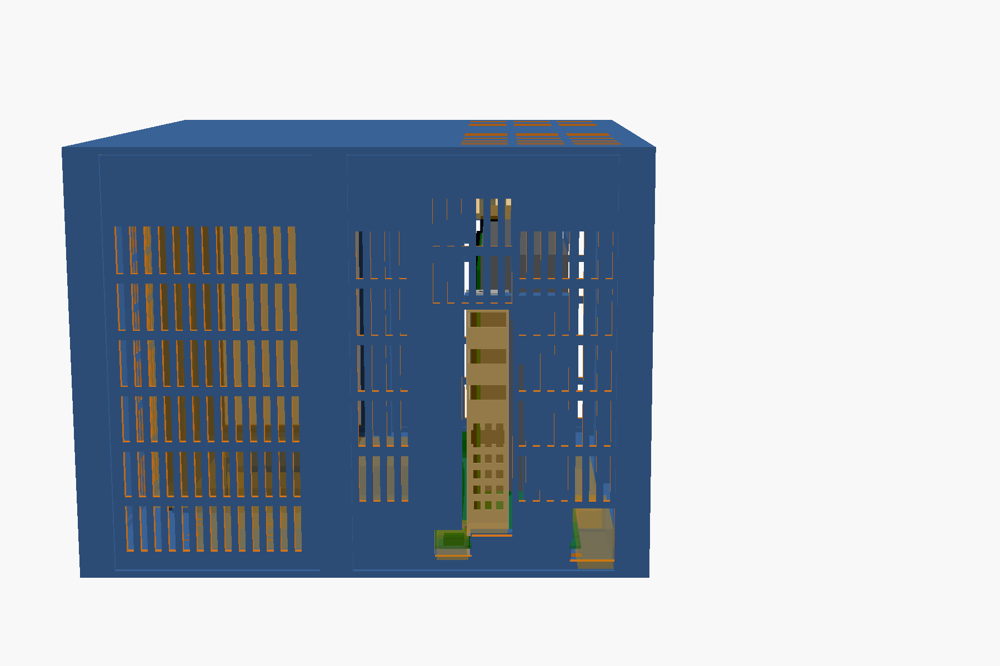
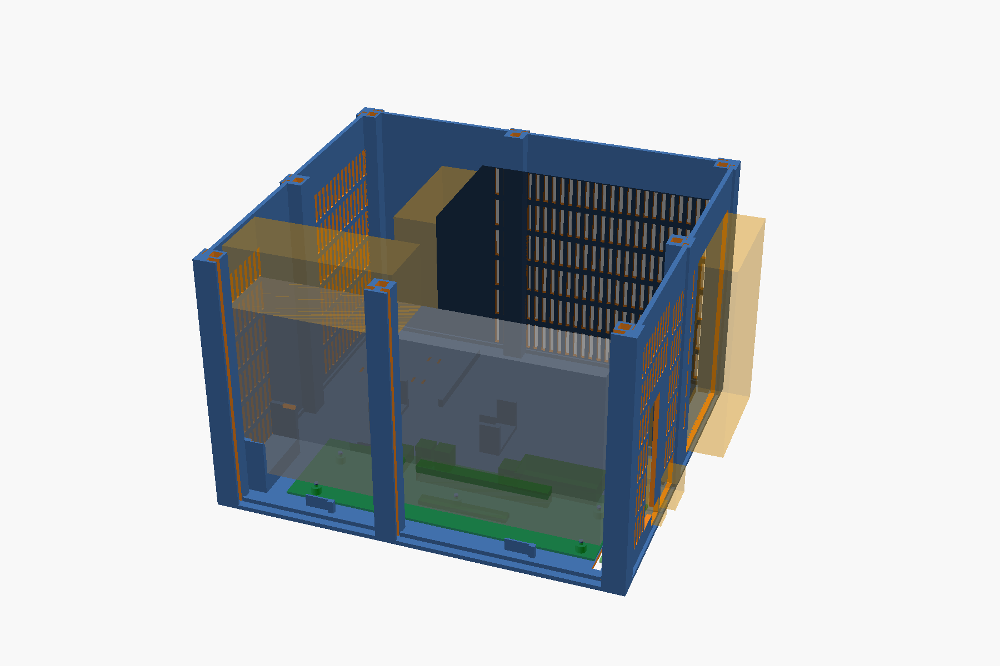

# A print-only case for the Lite board

`xgm-lite-frame.scad` is a parametric OpenSCAD enclosure for an **XG Mobile Station Lite** board
(osy's open-source XG Mobile dock, "Lite" variant), a **desktop graphics card** and an **ATX power
supply**. It needs no screws, threaded inserts, glue, magnets or 90° power adapters: the board sits on
printed pegs, the panels slide into printed posts, the lid pegs into the posts, the PSU is held by its
own weight and a few stops, and the card is held by the PCIe slot plus a printed cradle under its far end.

The defaults are the parts it was drawn around:

| Part | Default | Parameter(s) |
|---|---|---|
| Board | XG Mobile Station Lite, 220 × 65 mm, five Ø3.2 holes, geometry read from osy's KiCad file | `board_*`, `holes`, `pcie_*` |
| GPU | Inno3D RTX 3060 Twin X2 OC: 240 × 120 mm, 42.2 mm thick (measured), one 8-pin on top | `gpu_len`, `gpu_h`, `gpu_w` |
| PSU | ATX, 160 × 150 × 86 mm (Corsair RM850x and friends) | `psu_l`, `psu_w`, `psu_h` |

Outside dimensions with the measured parts: **271 × 244 × 184 mm**. The PSU lies on its side along
one long wall with its fan against a grille, IEC inlet in the far wall and modular face toward the
rear; the board and the card take the other side with the GPU's fans facing the opposite wall; between
them runs a 48 mm channel for the 24-pin plug, and the space between the rear wall and the PSU's
modular face is the cable bay, right beside the 24-pin header. The sleeved 24-pin bundle leaves its
plug, makes its wide bend inside the bay (measured: it reaches 87 mm from the board edge) and arrives
at the modular face; the spare length lies in the bay as one loop.

Two details of the Lite board that the case relies on, both visible in osy's KiCad file: the 3 mm
slot across the board at x = 13.7 mm is the chassis slot for the GPU bracket's foot (so the bracket
plane sits there, 47.5 mm in front of the PCIe contact A1, as the PCIe CEM spec says it should), and
the three 3 × 4 mm holes at x = 7.2 mm are for a bracket holder. This case prints that holder: it
stands in the three holes, passes through them into the floor, and the bracket's top tab rests on
its arm, which is how a PC chassis carries a card's front end.

## Airflow

- GPU intake: the whole +Y wall in front of the card's fans is slotted.
- GPU exhaust: slots in the lid above the card and in the far end wall; the card's own bracket vents
  exhaust through the display-port opening in the rear wall, 18 mm behind the ports, as in a PC.
- PSU intake: the −Y wall in front of the PSU fan is slotted; PSU exhaust leaves through its own rear
  grille, which sits in an opening in the rear wall. The two intakes are on opposite sides of the box.
- The lid sits 42 mm above the card so a straight 8-pin plug and a stiff sleeved cable fit without
  an adapter.
- The IEC power cord comes in at the far end; the laptop cable leaves at the rear.
- The laptop cable: its taped micro-coax harness runs along the board's fan-side edge, in the 24 mm
  gap between board and intake wall, and the thick cable with its boot leaves through an opening low
  in the rear wall at that corner.

## Orientation

KiCad's screen has Y pointing down, so a model built straight from its coordinates with Z up is a
mirror image of the real board. The design frame inside the .scad keeps KiCad's numbers as they are,
and `MIRROR = true` mirrors every export in Y to match reality; the paper plan is drawn as seen from
above with the component side up. If you read the source, remember that "+Y" there is the real board's
fan side. The clue was the rear photo: 24-pin and USB-C on the left, fans on the right.

## Measured, not assumed

The defaults are now the real parts, measured with calipers (see the table in `DIMENSIONS.md`): card
thickness 42.2, bracket tab 109.0 above the board, foot 9.7 below it, card's lowest point 18.9 above
the board at its far end, the sleeved 24-pin bend reaching 86.8 from the board edge, boot Ø15.1 × 37.1.
For another card or PSU, those are the numbers to re-measure; each is a single parameter at the top of
the file. The holder's arm is printed 0.1 mm low on purpose; `shim_05/10/15` go on it if the tab floats.

Then print `coupon` first (5 g, twenty minutes). It has a jigsaw tab and slot, a 6 mm peg and
socket, and a 3 mm panel slot. Everything should push together by hand and hold. If not, adjust
`tab_fit`, `peg_fit`, `slot_fit` (all in mm) and print it again. Fits vary between printers; this is
the cheap place to find out.

## Check the fit on paper first

`plan/floor-plan-A3.pdf` (one A3 page) and `plan/floor-plan-A4-2pages.pdf` (two A4 landscape pages,
tape them together along the alignment crosses) are the floor plan at 1:1: the frame, the posts, the
board with its holes, the card's footprint and bracket plane, the PSU, the cable channel with its two
saddles, the cradle, the holder, and the openings in the rear wall. Print at **actual size / 100 %**,
then check the 100 mm bar with a ruler. Lay the board, the card and the PSU on it, plug the 24-pin in
and see where the bundle wants to go. This costs nothing and catches the mistakes a render can't:
a cable that is stiffer than I think, a plug that sticks out further, a PSU that isn't the one on the
label. Re-export after changing parameters: `openscad -o plan/plan_a3.svg -D 'part="plan_a3"'
xgm-lite-frame.scad`, then `rsvg-convert -f pdf`.

## Viewing the model in 3D

- OpenSCAD itself (installed): `openscad xgm-lite-frame.scad`, press F5. Drag to orbit, scroll to
  zoom. In *Window → Customizer* set `part` to `assembly` (everything plus the real parts' volumes:
  board green, card grey, PSU black, plug and cable zones orange), `inside` (lid and intake wall
  removed), or any single part. Turn `vents` off for a faster preview.
- **`xgm-lite-frame-assembled.3mf`**: every part in its assembled position as a separate, named,
  coloured object (28 of them: the 4 floor quarters, 2 lid halves, 8 posts, 8 panels, cradle, holder,
  plus the board, card, PSU and cable zones). Open it in 3dviewer.net, Bambu Studio, PrusaSlicer or
  OrcaSlicer and hide a wall or the lid in the object list to look inside. 3dviewer.net works on a
  phone. The same parts as individual in-place STLs are in `stl/assembled/`.
- `stl/_assembly_structure.stl` and `stl/_assembly_ghosts.stl`: the same thing as just two meshes
  (printed parts, and the real parts' volumes), for viewers that only take STL.
- For printing, use `stl/<part>.stl`: one file per part, each already laid flat for the bed.

## Parts

Exact sizes of every part, where each one sits, and the feature dimensions are in
[`DIMENSIONS.md`](DIMENSIONS.md). Rendered STLs are in `stl/`. Re-render after changing parameters with `./render.sh` (all parts) or
`./render.sh floor_rr cradle` (some parts); `./render-assembled.sh` rebuilds the in-place set and the 3MF.

| Part | Qty | Size (mm) | Prints | Notes |
|---|---|---|---|---|
| `floor_rl`, `floor_rr`, `floor_fl`, `floor_fr` | 1 each | ≤ 151 × 131 × 25 | flat, as exported | the four floor quarters; jigsaw tabs join them. `floor_rr` carries the board pegs, the clips, the foot relief and the holder sockets; `floor_rl` the two cable saddles |
| `lid_l`, `lid_r` | 1 each | ≤ 151 × 231 × 75 | upside down, as exported | two-piece lid (needs a 235 mm bed). For smaller beds print `lid_rl`, `lid_rr`, `lid_fl`, `lid_fr` instead (≤ 151 × 131) |
| `post_corner` | 4 | 15 × 15 × 180 | upright, as exported (socket on the bed, peg up) | identical; mirrors are the same part |
| `post_mid` | 4 | 15 × 14 × 180 | upright | one per wall, where the panels split |
| `panel_rear_l`, `panel_rear_r`, `panel_far_l`, `panel_far_r` | 1 each | ≤ 178 × 111 × 3 | flat | rear wall: bay vents, USB-C hole, display-port opening, laptop-cable exit; far wall: PSU opening and GPU exhaust vents |
| `panel_left_r`, `panel_left_f`, `panel_right_r`, `panel_right_f` | 1 each | ≤ 144 × 178 × 3 | flat | left = PSU intake grille; right = GPU intake grille |
| `bracket_holder` | 1 | 116 × 51 × 6 | on its side, as exported | stands in the board's three holes; the bracket tab rests on its arm |
| `shim_05`, `shim_10`, `shim_15` | as needed | 24 × 6 | flat | 0.5 / 1.0 / 1.5 mm shims for the holder's arm |
| `cradle` | 1 | 55 × 49 × 18 | on its side, as exported | supports the card's far end; height from `card_bottom_clear` |
| `coupon` | 1 | 60 × 37 × 9 | flat | fit test |
| `coupon_rear` | 1 | 58 × 89 × 3 | flat | slice of the rear wall: cable exit, USB-C hole, bottom of the port window |
| `_assembly_structure`, `_assembly_ghosts` | — | — | not for printing | the whole thing, for viewers |

Roughly 1.1 to 1.3 kg of PETG depending on infill. Every part fits a 180 × 180 mm bed except the
two-piece lid; the posts need 182 mm of Z.

Print settings: PETG (PLA softens next to a hot GPU and creeps under the PSU), 0.2 mm layers, 3 to 4
perimeters, 25 to 40 % infill, no supports anywhere. Panels print flat with their outer face down.

## Test batch, then the rest

Print in this order; every stage proves something before you spend the filament on the next, and
everything except the two coupons ends up in the finished box.

**Stage 1, tolerances (one plate, about 25 g, under an hour): `coupon`, `coupon_rear`.**
The coupon's jigsaw tab goes into its slot, the 6 mm peg into its socket and a 3 mm strip of the
coupon (snap the thin bar off) into the panel slot, all by hand, all staying put. `coupon_rear` is a
slice of the real rear wall: push the laptop cable's rubber boot through the big opening, the USB-C
plug through the small one, and an HDMI plug through the bottom of the port window. If a fit is wrong,
change `tab_fit`, `peg_fit` or `slot_fit`, or tell me which hole binds, and reprint only the coupon.

**Stage 2, board fit (about 95 g): `floor_rr`, `bracket_holder`, `shim_05`, `shim_10`, `shim_15`.**
Bare board onto the five pegs: it should sit flat on the bosses with the four clips snapped over its
edges. Holder's three pegs down through the board's small holes. Card in: foot in the board's slot,
the tab resting on the holder's arm or floating a hair above it (shim). If the tab is well off the
arm, re-measure `tab_above_board`.

**Stage 3, card support (about 80 g): `floor_fr`, `cradle`.** Join the two quarters (jigsaw tabs),
card in, far end on the cradle; it must rest without lifting the card out of the slot. Off by more
than a millimetre: `card_bottom_clear`, and only the cradle reprints.

**Stage 4, structure sample (about 115 g): one `post_corner`, one `post_mid`, `panel_rear_r`.**
Posts into the floor sockets, the panel down into the slots, and this is where your printer's Z gets
checked against 180 mm posts.

**Stage 5, everything else:** `floor_rl`, `floor_fl`, 3 more `post_corner`, 3 more `post_mid`,
`panel_rear_l`, `panel_far_l`, `panel_far_r`, `panel_left_r`, `panel_left_f`, `panel_right_r`,
`panel_right_f`, and the lid: `lid_l` + `lid_r` on a 235 mm bed, otherwise `lid_rl`, `lid_rr`,
`lid_fl`, `lid_fr`.

## Order of work

1. `coupon`, tune fits.
2. `floor_rr`. Drop the bare board onto its five pegs. It should sit flat on the bosses with the edge
   clips over its edges and the pegs standing about 1 mm proud. If a peg misses, the board isn't the
   board this was drawn for; stop here.
3. `bracket_holder`. Its three pegs go down through the board's three small holes into the floor.
   Plug the card in: the bracket's foot drops into the board's slot and the tab should land on the
   holder's arm, or float just above it (shim). If the tab lands well off the arm, re-measure
   `tab_above_board`.
4. `cradle`, `floor_fr`. Set both floor pieces together and check that the card's far end rests on the
   cradle without lifting the card out of the slot. Re-measure `card_bottom_clear` if it doesn't.
5. Everything else.

## Assembly

1. Join the four floor quarters (press the jigsaw tabs down into their slots).
2. Push the eight posts into the square holes in the floor. Corner posts have two slots at 90°, mid
   posts two slots in line.
3. Board on its pegs; press down until the four edge clips snap over the edges. Bracket holder into
   its three holes.
4. PSU on its side, fan toward the −Y wall, IEC inlet toward the far wall, slid forward against the stops.
5. Card into the slot: foot in the board's slot, tab on the holder's arm, far end on the cradle. Then
   the 24-pin (its bundle leaves the plug, bends inside the bay and reaches the modular face; the spare
   length lies in the bay as one loop), the 8-pin over the top of the card into the same bay, and the
   laptop cable's boot out through the opening low in the rear wall.
6. Slide the eight panels down into the post slots. The panel with the big opening is the far wall on
   the PSU side.
7. Lid: the pegs drop into the posts, the two ribs straddle the card's top edge and the two guides
   straddle the top of the bracket.

Tie points: there are pairs of slots in the floor of the cable bay for zip ties, if you have them. The
box is lifted by its floor, not by the lid.

## What this case does not do

- The holder carries the card's front by its tab, but with gravity only: there is no thumbscrew. The
  lid guides straddle the top of the bracket so it cannot sway; lifting the whole box upside down is
  still a bad idea.
- The display ports sit 18 mm inside the rear wall; the opening in the panel is sized for plugs.
- It is not sealed against dust; it's a ventilated frame.

## Changing it

All geometry derives from the parameters at the top of the .scad. A longer card lengthens the box; a
thicker card widens the cradle and moves the GPU intake grille; a 140 mm PSU lengthens the cable bay.
`psu_wall_gap`, `atx_plug_clear`, `gap_y` and `plug8_clear` are the clearances that set the outside
size. `psu_iec_at_far = false` turns the PSU back round (IEC at the rear, bay at the far end), which
only makes sense with flat cables that can bend inside a 65 mm channel.

`openscad -o x.stl -D 'part="collision"' -D vents=false xgm-lite-frame.scad` renders the intersection
of the printed geometry with the volumes of the board (connectors included), the card, the PSU and the
plug/cable zones. It must come out empty; it does with the defaults. Run it after any change.
