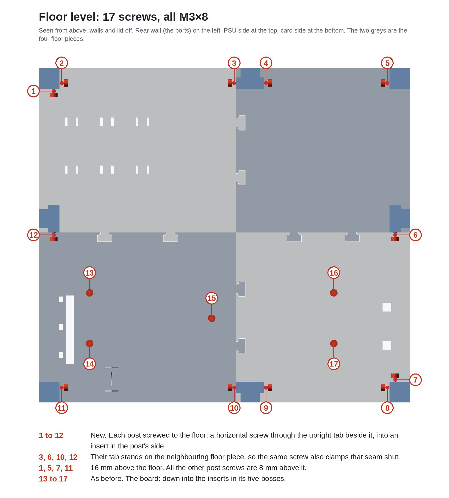
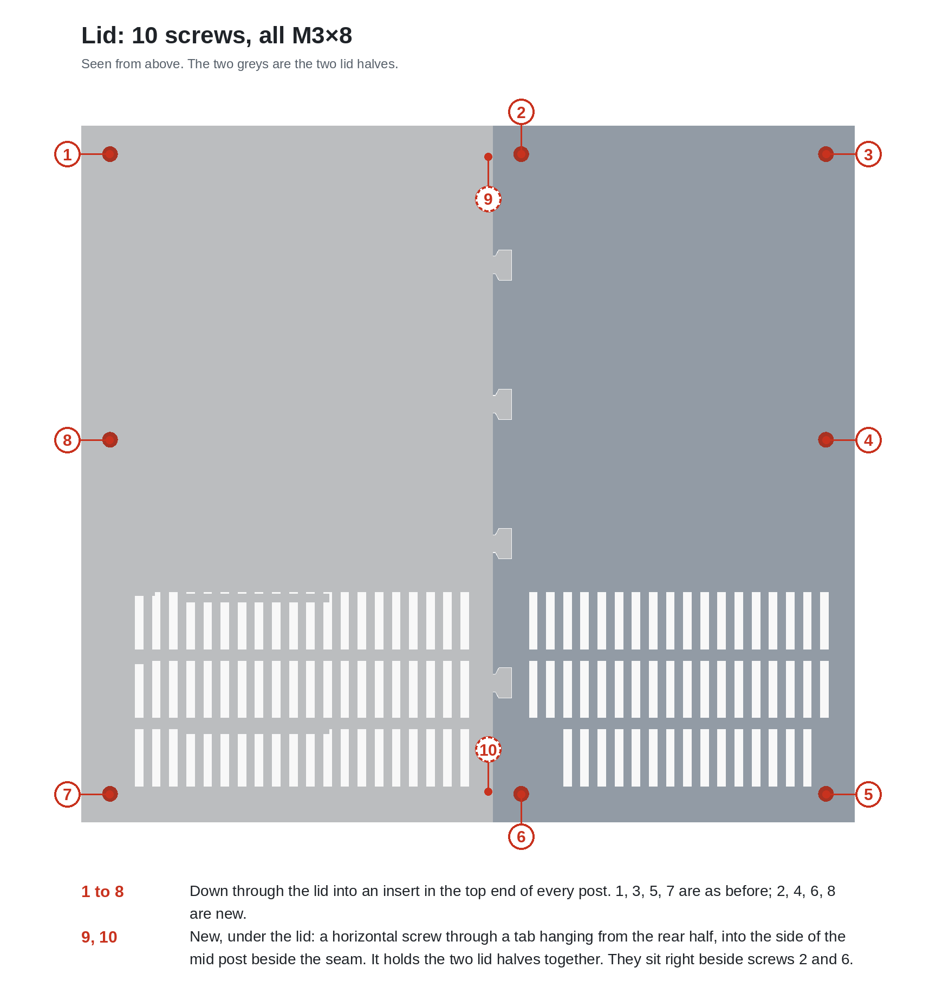
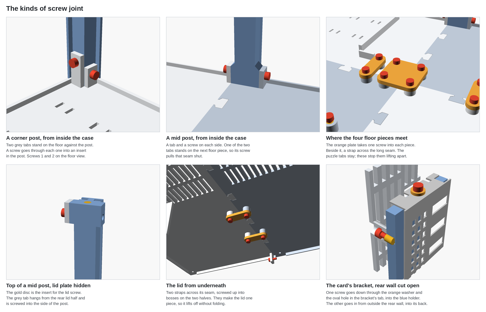

# XGM Lite frame · print pack

A print-only case for the **XG Mobile Station Lite** board, an **Inno3D RTX 3060 Twin X2 OC** and a
**Corsair RM850**. No glue: the parts peg, slot and slide together, and 41 M3×8 screws in heat-set
inserts hold the board, the posts, the lid, the seams between the floor's and the lid's pieces, and
the card's bracket.


## Settings

| Setting | Value |
|---|---|
| Material | **PETG**. PLA softens next to a warm GPU and creeps under the PSU's weight. |
| Layer height | 0.2 mm |
| Walls | 3 |
| Infill | 15 % |
| Plate | Textured PEI. Bambu's PETG profile refuses the smooth Cool Plate. Let the plate cool before removing parts. |
| Brim | None, so that the jigsaw edges come off the plate clean. The posts alone get 5 mm: they are 180 mm tall on a 15 mm foot. |
| Avoid crossing walls | On. PETG strings, and this keeps travel moves inside the part instead of across the vents. |
| Supports | **None.** Nothing in this pack needs them. |
| Orientation | As exported. Every file is already laid out for the bed. |
| Bed | 180 × 180 mm, except the two-piece lid, which needs 250 mm. On a Bambu X1 Carbon (256 mm) every part fits whole. |
| Height | 182 mm, for the posts |

> **The batch files already carry all of this**, on top of Bambu's stock profile for the X1 Carbon and PETG Basic. The table
> is there to check against, and for another slicer or printer. The tests use exactly the same settings as the case, so
> what fits in stage 1 fits in stage 4.

## The plan

| Stage | Folder | What it proves | Batches | Time | Plastic |
|:-:|---|---|:-:|--:|--:|
| 1 | [`1-tests`](1-tests/) | your printer's fits, the real plugs in the real openings, the grommet clip, the insert holes | 1 | 1 h 06 | ≈ 25 g |
| 2 | [`2-board-and-card`](2-board-and-card/) | the board screwed down on its five inserts, the card on its two supports | 2 | 3 h 11 | ≈ 110 g |
| 3 | [`3-structure-sample`](3-structure-sample/) | full-height posts, and a wall in its slots | 2 | 6 h 35 | ≈ 140 g |
| 4 | [`4-final`](4-final/) | the rest of the box | 8 | 19 h 59 | ≈ 620 g |

### Print order

A batch is one plate on the printer. Print them from the top down: each one is the next thing worth knowing, and
nothing below it is worth the plastic until it has passed.

```
1 · Tests                                 1 h 06 · 25 g
└── 1A-tests.3mf                          1 h 06 · 25 g
    ├── coupon                      two identical pieces: jigsaw tab, square peg and wall slot
    ├── coupon_inserts              three bosses, insert holes of 3.8, 4.0 and 4.2 mm
    ├── coupon_grommet              three clips, slots of 10.5, 11.5 and 12.5 mm
    └── coupon_rear                 a slice of the rear wall: cable notch, USB-C hole, port window

2 · Board and card                        3 h 11 · 110 g
├── 2A-floor-board-rear.3mf               1 h 42 · 55 g
│   ├── floor_rr                    three of the five board bosses, the holder's holes, the grommet clip, three post tabs
│   ├── bracket_holder              stands in the board's three small holes; the bracket's tab is screwed to its top edge
│   └── 2 × bracket_washer          goes under the head of the bracket's screw; the second one is a spare
└── 2B-floor-board-far.3mf                1 h 29 · 50 g
    ├── floor_fr                    the other two board bosses, four post tabs
    └── cradle                      under the card's far end

3 · Structure sample                      6 h 35 · 140 g
├── 3A-posts-sample.3mf                   3 h 41 · 45 g
│   ├── post_corner                 inserts in its top end and in its side, near the foot
│   └── post_mid                    between two wall panels; inserts in its top end and its sides
└── 3B-card-side-wall.3mf                 2 h 54 · 95 g
    ├── panel_right_r               intake grille for the card's fans, rear half
    └── panel_right_f               intake grille for the card's fans, far half

4 · The rest                              19 h 59 · 620 g
├── 4A-floor-cable-bay.3mf                1 h 24 · 45 g
│   └── floor_rl                    under the cable bay and the near end of the PSU, three post tabs
├── 4B-floor-psu.3mf                      1 h 24 · 45 g
│   ├── floor_fl                    under most of the PSU, two post tabs
│   ├── bridge_centre               the plate over the point where the four floor pieces meet
│   └── 4 × bridge_strap            two across the floor's long seam, two under the lid's seam
├── 4C-posts.3mf                          5 h 52 · 140 g
│   ├── 3 × post_corner             inserts in its top end and in its side, near the foot
│   └── 3 × post_mid                between two wall panels; inserts in its top end and its sides
├── 4D-rear-wall.3mf                      2 h 41 · 80 g
│   ├── panel_rear_r                USB-C opening, display-port window, laptop-cable notch, and the boss that is screwed to the bracket holder
│   └── panel_rear_l                vents over the cable bay
├── 4E-far-wall.3mf                       1 h 48 · 65 g
│   ├── panel_far_l                 opening for the PSU's power inlet and switch
│   └── panel_far_r                 exhaust grille for the card
├── 4F-psu-side-wall.3mf                  2 h 41 · 95 g
│   ├── panel_left_r                PSU intake grille, rear half
│   └── panel_left_f                PSU intake grille, far half
├── 4G-lid-rear.3mf                       2 h 15 · 85 g
│   └── lid_l                       with the two tabs that are screwed to the mid posts
└── 4H-lid-far.3mf                        1 h 54 · 70 g
    └── lid_r                       vents only
```

### Printing a batch

1. In OrcaSlicer, **File → Open Project** and pick the batch's `.3mf`. The parts come in already arranged, with the
   printer (Bambu Lab X1 Carbon, 0.4 nozzle), the filament (Bambu PETG Basic), the textured plate and the settings above.
2. Check that the filament slot matches where your spool sits in the AMS, then **Slice plate**.
3. **Print plate**, or export the sliced file to the printer's card.

The parts are placed clear of the front 14 mm of the bed, where the X1 Carbon draws its purge and flow-calibration lines
before every print: leave them where they are. Bambu Studio may offer to load only the geometry of a file made by
OrcaSlicer; if it does, set the values from the table by hand. For any other slicer, the loose STLs are in each stage's
`stl/` folder.

Print the stages in order, and start a stage only when the previous one passed. Only the stage 1 tests
are throwaway: everything else ends up in the finished case. About **895 g** of PETG in total.

The times and weights are real slices of these very files, not estimates: OrcaSlicer 2.4.2, Bambu Lab X1 Carbon, Bambu PETG Basic, 3 walls, 15 % infill. At these settings **one 1 kg spool covers the whole pack**, tests included, with about 105 g to spare; 4 walls and 40 % infill push it just past a kilo. Allow about 31 hours of printing in all. The longest single batch is `4C-posts`, at 5 h 52: tall, thin posts print slowly, one small layer at a time.

---

## 1 · Tests


| Order | Open this file | Pieces | Time | Plastic |
|:-:|---|---|--:|--:|
| 1 | [`1A-tests.3mf`](1-tests/1A-tests.3mf) | `coupon`, `coupon_inserts`, `coupon_grommet`, `coupon_rear` | 1 h 06 | ≈ 25 g |

**coupon** holds two identical pieces that you test against each other. Each fit should go together
by hand and stay put: neither forced nor loose.

- [ ] One piece's jigsaw tab presses down into the other's notch. *This is how the floor and lid pieces join.*
- [ ] Laid on the other, one piece's square peg goes through the other's square hole. *This is how the posts and the lid seat.*
- [ ] One piece's tab pushes edge-first into the other's long thin slot. *This is how the walls sit in the posts.*

**coupon_rear** is the bottom of the real rear wall, board side.

- [ ] It slides down over the thick laptop cable without pinching it. *The real wall goes in exactly like this.*
- [ ] A USB-C plug goes through the small hole.
- [ ] An HDMI plug goes into the bottom of the big window.

**coupon_grommet** has three small clips with slots of 10.5, 11.5 and 12.5 mm, the number printed
beside each. The clip's thin wall goes into the gap between the grommet's round disc and square plate,
and the rubber neck clicks down into the slot.

- [ ] One of the three holds the grommet firmly: pushing it in takes a little force, it doesn't fall out, and the rubber isn't badly squashed. *Tell me which number.*

**coupon_inserts** has three bosses like the ones that hold the board, with holes of 3.8, 4.0 and
4.2 mm. Melt one M3×5×4.5 insert into each with a soldering iron at about 230 °C, pressing straight
down until it sits flush, then let it cool.

- [ ] One of the three takes its insert straight and flush, and an M3 screw tightens into it firmly without the insert turning. *Tell me which number.*

**If something fails:** note which fit binds or rattles, or which clip held the grommet best. One
number changes in the model, and only the coupon is reprinted.

---

## 2 · Board and card


| Order | Open this file | Pieces | Time | Plastic |
|:-:|---|---|--:|--:|
| 1 | [`2A-floor-board-rear.3mf`](2-board-and-card/2A-floor-board-rear.3mf) | `floor_rr`, `bracket_holder`, 2 × `bracket_washer` | 1 h 42 | ≈ 55 g |
| 2 | [`2B-floor-board-far.3mf`](2-board-and-card/2B-floor-board-far.3mf) | `floor_fr`, `cradle` | 1 h 29 | ≈ 50 g |

- [ ] The two floor pieces press together on their jigsaw tabs and lie flat on the table.
- [ ] The five inserts are melted into the round bosses, straight and flush: three on `floor_rr`, two on `floor_fr`.
- [ ] The bare board sits flat on the five bosses, and five M3×8 screws pull it down without rocking. M3×6 also works; nothing longer than 8.
- [ ] Two inserts are melted into the holder: one into the hole in its top edge, one into the hole in its back, the face that lay on the bed. The one in the top edge has only a millimetre of plastic on either side: press gently and stop when it is flush.
- [ ] The holder's three pegs go down through the board's three small holes, into the floor. Its back, the face with the insert, looks away from the card.
- [ ] With the card plugged in, the bracket's foot sits in the board's slot and its top tab lies over the holder's top edge.
- [ ] The oval hole in the tab sits over the insert. An M3×8 with a `bracket_washer` under its head goes down through it and tightens; the holder lifts a little to meet the tab, which is intended.
- [ ] The card's far end rests on the cradle without lifting the card out of its slot.

**If something fails:**

- *The bosses don't meet the board's holes:* stop and send a photo. The board isn't what its design file says.
- *The tab's oval hole misses the insert, or the holder's top edge sits more than a millimetre above or below the tab:* send a photo from straight above with a ruler in it. Only the holder is reprinted.
- *The cradle lifts the card, or there's daylight under it:* re-measure the card's lowest point. Only the cradle is reprinted.

---

## 3 · Structure sample


| Order | Open this file | Pieces | Time | Plastic |
|:-:|---|---|--:|--:|
| 1 | [`3A-posts-sample.3mf`](3-structure-sample/3A-posts-sample.3mf) | `post_corner`, `post_mid` | 3 h 41 | ≈ 45 g |
| 2 | [`3B-card-side-wall.3mf`](3-structure-sample/3B-card-side-wall.3mf) | `panel_right_r`, `panel_right_f` | 2 h 54 | ≈ 95 g |

These go on the floor from stage 2: the corner post at the rear corner on the card side, the mid post
in the middle of the card-side wall, and `panel_right_r` between them. The other half of that wall,
`panel_right_f`, waits for its corner post in stage 4.

Inserts for these two posts: one in each top end; one in the corner post's higher side hole; one in
each of the mid post's two foot bosses.

- [ ] The posts came out clean at full height, with no wobble or shifted layers near the top.
- [ ] Every insert went in straight and flush, the ones in the side holes included.
- [ ] Each post's peg drops into its square hole in the floor, and the post stands upright on its own.
- [ ] An M3×8 through each floor tab pulls its post up against the tab without tilting it: one screw
      for the corner post, two for the mid post.
- [ ] With the mid post's two screws tight, the seam between the two floor pieces beside it is closed.
- [ ] `panel_right_r` slides down into both posts' slots, all the way to the floor.

---

## 4 · The rest


| Order | Open this file | Pieces | Time | Plastic |
|:-:|---|---|--:|--:|
| 1 | [`4A-floor-cable-bay.3mf`](4-final/4A-floor-cable-bay.3mf) | `floor_rl` | 1 h 24 | ≈ 45 g |
| 2 | [`4B-floor-psu.3mf`](4-final/4B-floor-psu.3mf) | `floor_fl`, `bridge_centre`, 4 × `bridge_strap` | 1 h 24 | ≈ 45 g |
| 3 | [`4C-posts.3mf`](4-final/4C-posts.3mf) | 3 × `post_corner`, 3 × `post_mid` | 5 h 52 | ≈ 140 g |
| 4 | [`4D-rear-wall.3mf`](4-final/4D-rear-wall.3mf) | `panel_rear_r`, `panel_rear_l` | 2 h 41 | ≈ 80 g |
| 5 | [`4E-far-wall.3mf`](4-final/4E-far-wall.3mf) | `panel_far_l`, `panel_far_r` | 1 h 48 | ≈ 65 g |
| 6 | [`4F-psu-side-wall.3mf`](4-final/4F-psu-side-wall.3mf) | `panel_left_r`, `panel_left_f` | 2 h 41 | ≈ 95 g |
| 7 | [`4G-lid-rear.3mf`](4-final/4G-lid-rear.3mf) | `lid_l` | 2 h 15 | ≈ 85 g |
| 8 | [`4H-lid-far.3mf`](4-final/4H-lid-far.3mf) | `lid_r` | 1 h 54 | ≈ 70 g |

Print the floor first, then the posts: every wall needs a post on each side before it can go in, and the
lid goes on last.

**Inserts for the six posts of this stage**, 15 in all: one in every top end; one in each corner
post's higher side hole, and one in the lower side hole of the two that go to the corners with two
tabs (rear wall on the PSU side, far wall on the card side); for the mid posts, one in a foot boss
of the rear-wall and far-wall ones, and one in each foot boss of the PSU-side one. The two mid posts
beside the lid's seam, PSU side and card side, also take one in a top boss, facing the rear.

**Inserts for the seam bridges**, 12: one in each of the eight low bosses beside the floor's seams, two
per floor piece, and one in each of the four bosses under the lid.

**Screws**, all M3×8: every post to the floor tab or tabs beside it; the centre plate over the point
where the four floor pieces meet, and a strap across the long seam on each side of it; then the lid.
Join its two halves upside down and screw the other two straps across the seam, so that it is one
piece; lower it, and put eight screws down into the posts and two sideways through the tabs under its
rear half.

**The bracket holder to the rear wall**, one screw: `panel_rear_r` has a short boss on its inside with a hole
right through from the outside. Once that panel is down in its slots, put an M3×8 on the end of the hex key,
pass it down the hole and tighten it into the insert in the holder's back. Do this after the bracket's own screw
and before the lid goes on.

**On a bed under 250 mm**, print the four files in [`4-final/lid-quarters-if-bed-under-250mm`](4-final/lid-quarters-if-bed-under-250mm/)
instead of the two lid batches.


## Where every insert and screw goes

41 inserts and 41 M3×8 socket-head screws: 25 at floor level, 14 for the lid and 2 at the card's bracket, which
are the last picture below. The horizontal ones must be M3×8: a longer screw bottoms out before it clamps.







## Folder layout

```
print-pack/
├── README.md                  this file
├── 1-tests/                   1A-tests.3mf
│   └── stl/                   the same pieces as loose STLs
├── 2-board-and-card/          2A and 2B
│   └── stl/
├── 3-structure-sample/        3A and 3B
│   └── stl/
├── 4-final/                   4A to 4G
│   ├── stl/
│   └── lid-quarters-if-bed-under-250mm/   lid_rl, lid_rr, lid_fl, lid_fr
├── reference/                 assembled 3MF, 1:1 floor plans, full notes, every dimension
└── img/                       the pictures in this file
```

## Reference

- [`xgm-lite-frame-assembled.3mf`](reference/xgm-lite-frame-assembled.3mf): the whole case assembled,
  every part a separate object. File → Open Project in Orca, then hide parts in the object list to look
  inside. **Not for printing.**
- [`floor-plan-A3.pdf`](reference/floor-plan-A3.pdf) and [`floor-plan-A4-2pages.pdf`](reference/floor-plan-A4-2pages.pdf):
  the floor plan at 1:1. Print at 100 % and lay the real parts on it. The A4 pair is drawn sideways so it
  fits an inkjet's printable area: cut sheet 1 along its dashed line and lay it on sheet 2, cut edge on the
  dashed line there, crosses on crosses.
- [`README.md`](reference/README.md): the full notes, including the assembly order.
- [`DIMENSIONS.md`](reference/DIMENSIONS.md): every part's size and position.
