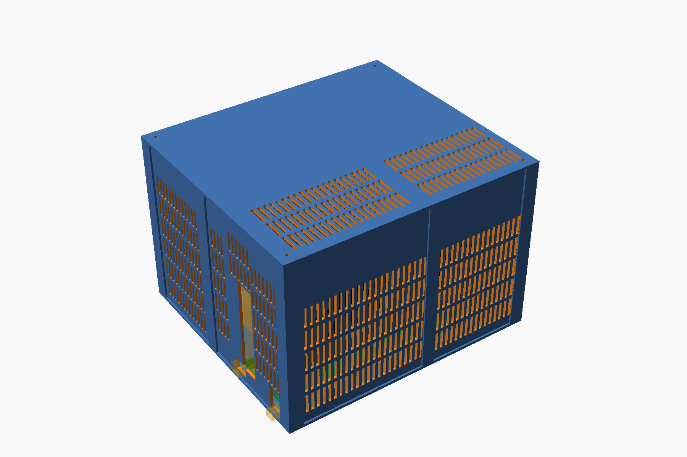
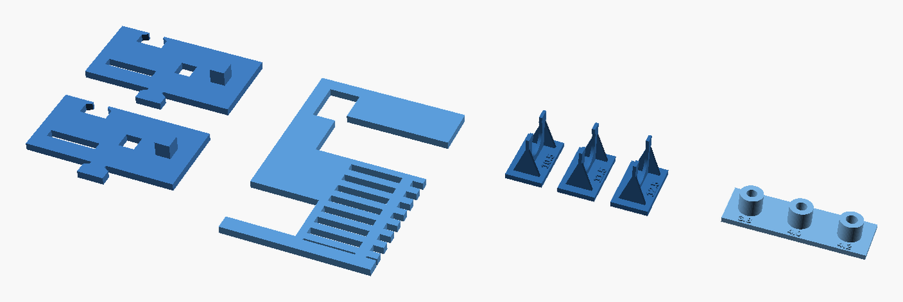
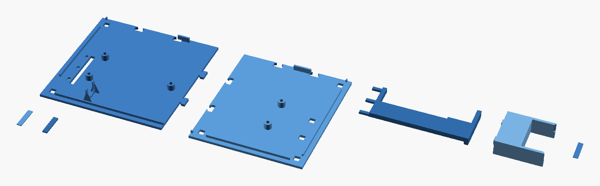
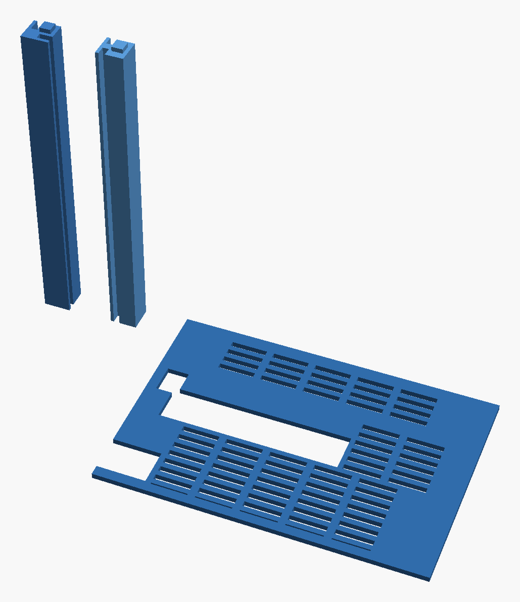
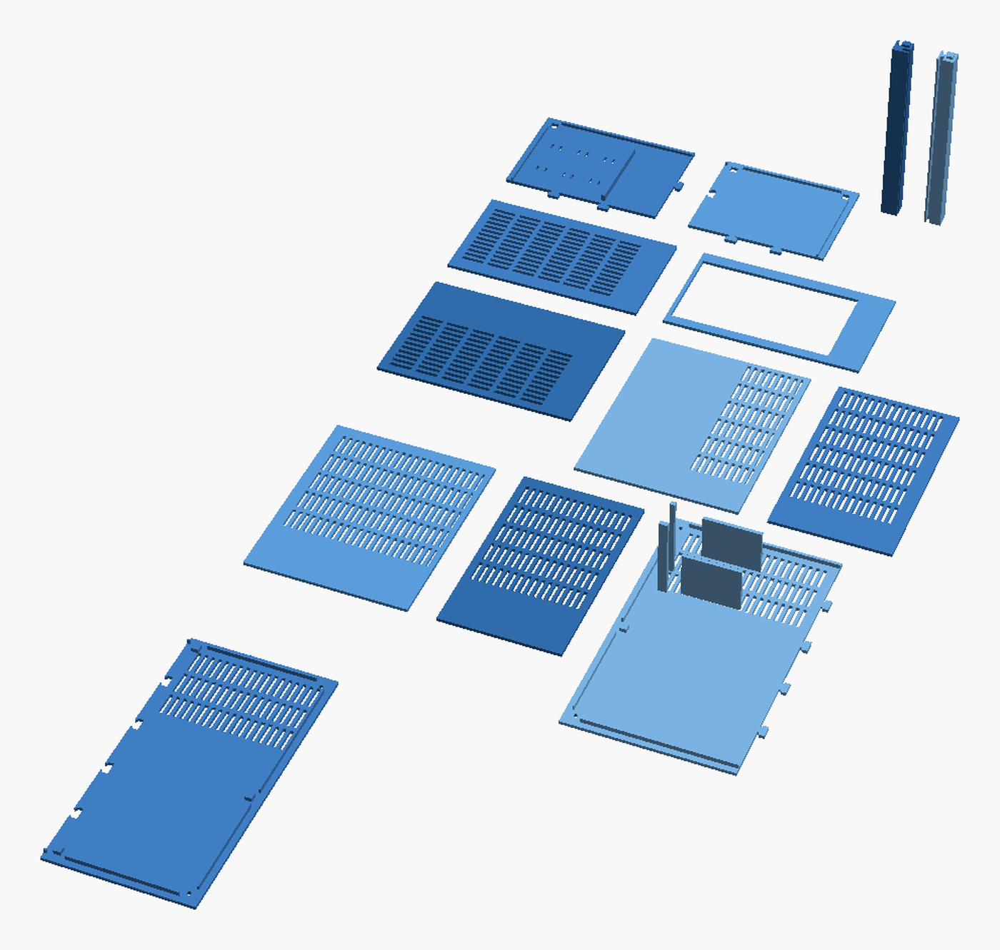
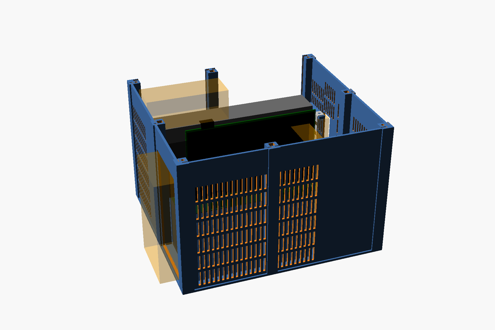

# XGM Lite frame · print pack

A print-only case for the **XG Mobile Station Lite** board, an **Inno3D RTX 3060 Twin X2 OC** and a
**Corsair RM850**. No screws, glue or adapters: everything pegs, clips and slides together.



## Settings

| Setting | Value |
|---|---|
| Material | **PETG**. PLA softens next to a warm GPU and creeps under the PSU's weight. |
| Layer height | 0.2 mm |
| Walls | 3 to 4 |
| Infill | 25 to 40 % |
| Supports | **None.** Nothing in this pack needs them. |
| Orientation | As exported. Every file is already laid out for the bed. |
| Bed | 180 × 180 mm, except the two-piece lid, which needs 250 mm |
| Height | 182 mm, for the posts |

> **Pick a PETG filament profile in the slicer.** The default is PLA.

## The plan

| Stage | Folder | What it proves | Plastic |
|:-:|---|---|--:|
| 1 | [`1-tests`](1-tests/) | your printer's fits, the real plugs in the real openings, the grommet clip, the insert holes | ≈ 30 g |
| 2 | [`2-board-and-card`](2-board-and-card/) | the board on its pegs and clips, the card on its two supports | ≈ 185 g |
| 3 | [`3-structure-sample`](3-structure-sample/) | full-height posts, and a wall in its slots | ≈ 100 g |
| 4 | [`4-final`](4-final/) | the rest of the box | ≈ 830 g |

Print the stages in order, and start a stage only when the previous one passed. Only the two coupons
are throwaway: everything else ends up in the finished case. About **1140 g** of PETG in total.

---

## 1 · Tests



| File | Qty | Size (mm) | Plastic |
|---|:-:|---|--:|
| `coupon.stl` | 1 file, 2 pieces | 60 × 82 × 9 | ≈ 10 g |
| `coupon_rear.stl` | 1 | 58 × 89 × 3 | ≈ 10 g |
| `coupon_grommet.stl` | 1 file, 3 pieces | 54 × 24 × 19 | ≈ 3 g |
| `coupon_inserts.stl` | 1 | 52 × 17 × 9 | ≈ 3 g |

**coupon** holds two identical pieces that you test against each other. Each fit should go together
by hand and stay put: neither forced nor loose.

- [ ] One piece's jigsaw tab presses down into the other's notch. *This is how the floor and lid pieces join.*
- [ ] Laid on the other, one piece's square peg goes through the other's square hole. *This is how the posts and the lid seat.*
- [ ] One piece's tab pushes edge-first into the other's long thin slot. *This is how the walls sit in the posts.*

**coupon_rear** is the bottom of the real rear wall, board side.

- [ ] It slides down over the thick laptop cable without pinching it. *The real wall goes in exactly like this.*
- [ ] A USB-C plug goes through the small hole.
- [ ] An HDMI plug goes into the bottom of the big window.

**coupon_grommet** has three small clips with slots of 10.5, 11.5 and 12.5 mm, the number printed
beside each. The clip's thin wall goes into the gap between the grommet's round disc and square plate,
and the rubber neck clicks down into the slot.

- [ ] One of the three holds the grommet firmly: pushing it in takes a little force, it doesn't fall out, and the rubber isn't badly squashed. *Tell me which number.*

**coupon_inserts** has three bosses like the ones that hold the board, with holes of 3.8, 4.0 and
4.2 mm. Melt one M3×5×4.5 insert into each with a soldering iron at about 230 °C, pressing straight
down until it sits flush, then let it cool.

- [ ] One of the three takes its insert straight and flush, and an M3 screw tightens into it firmly without the insert turning. *Tell me which number.*

**If something fails:** note which fit binds or rattles, or which clip held the grommet best. One
number changes in the model, and only the coupon is reprinted.

---

## 2 · Board and card



| File | Qty | Size (mm) | Plastic |
|---|:-:|---|--:|
| `floor_rr.stl` | 1 | 150 × 144 × 19 | ≈ 70 g |
| `floor_fr.stl` | 1 | 127 × 144 × 9.9 | ≈ 65 g |
| `bracket_holder.stl` | 1 | 120 × 46 × 9 | ≈ 20 g |
| `cradle.stl` | 1 | 55 × 49 × 18 | ≈ 30 g |
| `shim_05.stl` | 1 | 5.5 × 24 × 0.5 | ≈ 1 g |
| `shim_10.stl` | 1 | 5.5 × 24 × 1 | ≈ 1 g |
| `shim_15.stl` | 1 | 5.5 × 24 × 1.5 | ≈ 1 g |

- [ ] The two floor pieces press together on their jigsaw tabs and lie flat on the table.
- [ ] The five inserts are melted into the round bosses, straight and flush: three on `floor_rr`, two on `floor_fr`.
- [ ] The bare board sits flat on the five bosses, and five M3×8 screws pull it down without rocking. M3×6 also works; nothing longer than 8.
- [ ] The holder's three pegs go down through the board's three small holes, into the floor.
- [ ] With the card plugged in, the bracket's foot sits in the board's slot.
- [ ] The bracket's top tab rests on the holder's arm, or floats a hair above it. Slide shims under it until it touches.
- [ ] The card's far end rests on the cradle without lifting the card out of its slot.

**If something fails:**

- *The bosses don't meet the board's holes:* stop and send a photo. The board isn't what its design file says.
- *The tab is more than 2 mm off the arm:* re-measure the tab height. Only the holder is reprinted.
- *The cradle lifts the card, or there's daylight under it:* re-measure the card's lowest point. Only the cradle is reprinted.

---

## 3 · Structure sample



| File | Qty | Size (mm) | Plastic |
|---|:-:|---|--:|
| `post_corner.stl` | 1 | 15 × 15 × 180 | ≈ 25 g |
| `post_mid.stl` | 1 | 15 × 14 × 180 | ≈ 25 g |
| `panel_rear_r.stl` | 1 | 177 × 123 × 3 | ≈ 50 g |

These go on the floor from stage 2: the corner post at the board's rear corner, the mid post in the
middle of the rear edge, and the wall between them.

- [ ] The posts came out clean at full height, with no wobble or shifted layers near the top.
- [ ] The corner post takes an insert in its top end, straight and flush.
- [ ] Each post's peg drops into its square hole in the floor, and the post stands upright on its own.
- [ ] The wall slides down into both posts' slots, all the way to the floor.
- [ ] The wall's bottom notch drops over the thick laptop cable.

---

## 4 · The rest



| File | Qty | Size (mm) | Plastic |
|---|:-:|---|--:|
| `floor_rl.stl` | 1 | 150 × 106 × 9 | ≈ 50 g |
| `floor_fl.stl` | 1 | 127 × 106 × 6 | ≈ 45 g |
| `post_corner.stl` | 3 more | 15 × 15 × 180 | ≈ 70 g |
| `post_mid.stl` | 3 more | 15 × 14 × 180 | ≈ 70 g |
| `panel_rear_l.stl` | 1 | 177 × 99 × 3 | ≈ 45 g |
| `panel_far_l.stl` | 1 | 177 × 99 × 3 | ≈ 20 g |
| `panel_far_r.stl` | 1 | 177 × 123 × 3 | ≈ 60 g |
| `panel_left_r.stl` | 1 | 143 × 177 × 3 | ≈ 75 g |
| `panel_left_f.stl` | 1 | 106 × 177 × 3 | ≈ 45 g |
| `panel_right_r.stl` | 1 | 143 × 177 × 3 | ≈ 65 g |
| `panel_right_f.stl` | 1 | 106 × 177 × 3 | ≈ 50 g |
| `lid_l.stl` | 1 | 150 × 244 × 75 | ≈ 130 g |
| `lid_r.stl` | 1 | 127 × 244 × 7 | ≈ 95 g |

**Screws:** melt an insert into the top end of each of the other three corner posts. The lid is held by
four M3×8 or M3×10 screws through its corners.

**On a bed under 250 mm**, print the four files in [`4-final/lid-quarters-if-bed-under-250mm`](4-final/lid-quarters-if-bed-under-250mm/)
instead of `lid_l` and `lid_r`.



## Folder layout

```
print-pack/
├── README.md                  this file
├── 1-tests/                   coupon, coupon_rear
├── 2-board-and-card/          floor_rr, floor_fr, bracket_holder, cradle, shim_05, shim_10, shim_15
├── 3-structure-sample/        post_corner, post_mid, panel_rear_r
├── 4-final/                   the remaining floor, posts, walls and lid
│   └── lid-quarters-if-bed-under-250mm/   lid_rl, lid_rr, lid_fl, lid_fr
├── reference/                 assembled 3MF, 1:1 floor plans, full notes, every dimension
└── img/                       the pictures in this file
```

## Reference

- [`xgm-lite-frame-assembled.3mf`](reference/xgm-lite-frame-assembled.3mf): the whole case assembled,
  every part a separate object. Open it in a slicer and hide parts to look inside. **Not for printing.**
- [`floor-plan-A3.pdf`](reference/floor-plan-A3.pdf) and [`floor-plan-A4-2pages.pdf`](reference/floor-plan-A4-2pages.pdf):
  the floor plan at 1:1. Print at 100 % and lay the real parts on it.
- [`README.md`](reference/README.md): the full notes, including the assembly order.
- [`DIMENSIONS.md`](reference/DIMENSIONS.md): every part's size and position.
